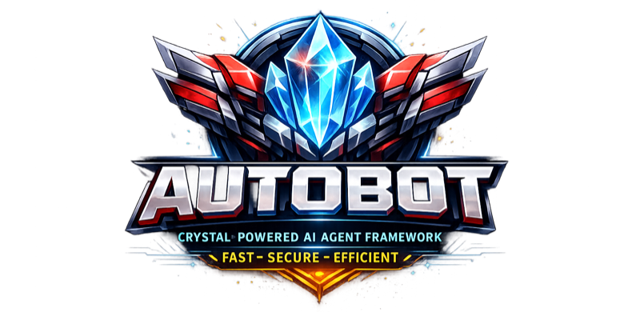

<p align="center">
  
</p>

# Autobot

**Ultra-efficient personal AI assistant powered by Crystal**

Compiled binary • Multi-provider LLM • Chat integrations • Plugin system

---

## Why Autobot?

Built with [Crystal](https://crystal-lang.org), Autobot delivers native performance with a developer-friendly experience. Alternative to [nanobot](https://github.com/HKUDS/nanobot) with faster startup and compiled distribution.

| Metric | Value |
|--------|-------|
| **Binary size** | ~2MB (optimized) |
| **Docker image** | <50MB |
| **Runtime** | Zero dependencies |
| **Startup** | Instant (<100ms) |

---

## ✨ Features

### Core
- **Compiled binary** - Single static executable, no runtime required
- **Multi-provider LLM** - Anthropic, OpenAI, DeepSeek, Groq, Gemini, OpenRouter, vLLM
- **Memory system** - MEMORY.md (long-term) + HISTORY.md (searchable log)
- **Sessions** - JSONL-based conversation persistence

### Integrations
- **Chat channels** - Telegram, Slack, WhatsApp (via bridge)
- **Tool system** - File operations, shell exec, web search/fetch, custom bash tools
- **Cron scheduler** - Scheduled jobs with cron expressions and intervals
- **Plugin system** - Extend with custom tools and integrations

### Advanced
- **Skills** - Markdown-based skill files with frontmatter and auto-discovery
- **Custom commands** - Telegram slash commands backed by prompt macros or bash scripts
- **Subagents** - Spawn specialized agents for complex tasks
- **Logging** - Token usage tracking and file operation audit

---

## 🚀 Quick Start

### 1. Install

```bash
# From source
git clone https://github.com/veelenga/autobot.git
cd autobot
make install

# Or with Docker
docker pull ghcr.io/veelenga/autobot:latest
```

### 2. Initialize

```bash
autobot onboard
```

Creates `~/.config/autobot/` with config, workspace, sessions, skills, and logs.

### 3. Configure

Edit `~/.config/autobot/config.yml`:

```yaml
providers:
  anthropic:
    api_key: "${ANTHROPIC_API_KEY}"

channels:
  telegram:
    enabled: true
    token: "YOUR_BOT_TOKEN"
    allow_from: ["your_username"]
```

### 4. Run

```bash
# Interactive mode
autobot agent

# Gateway (all channels)
autobot gateway

# Single command
autobot agent -m "Summarize this project"
```

**→ [Full Quick Start Guide](docs/quickstart.md)**

---

## 📚 Documentation

| Document | Description |
|----------|-------------|
| [Quick Start](docs/quickstart.md) | Installation and first steps |
| [Configuration](docs/configuration.md) | Complete config reference |
| [CLI Reference](docs/cli.md) | All commands and options |
| [Architecture](docs/architecture.md) | System design and components |
| [Plugins](docs/plugins.md) | Building and using plugins |
| [Security](docs/security.md) | Security model and best practices |
| [Examples](docs/examples.md) | Use cases and code samples |
| [Development](docs/development.md) | Contributing and local setup |

---

## 💡 Examples

<details>
<summary><b>Telegram Bot with Custom Commands</b></summary>

```yaml
channels:
  telegram:
    enabled: true
    token: "BOT_TOKEN"
    allow_from: ["your_username"]
    custom_commands:
      macros:
        summarize: "Summarize our conversation in 3 bullet points"
        translate: "Translate the following to English"
      scripts:
        deploy: "/home/user/scripts/deploy.sh"
        status: "/home/user/scripts/system_status.sh"
```

Use `/summarize` or `/deploy` in Telegram to trigger them.

</details>

<details>
<summary><b>Cron Scheduler</b></summary>

```bash
# Daily morning greeting
autobot cron add --name "morning" \
  --message "Good morning! Here's today's summary" \
  --cron "0 9 * * *"

# Hourly reminder
autobot cron add --name "reminder" \
  --message "Stand up and stretch!" \
  --every 3600

# One-time meeting notification
autobot cron add --name "meeting" \
  --message "Team sync in 5 minutes!" \
  --at "2025-03-01T10:00:00"
```

</details>

<details>
<summary><b>Multi-Provider Setup</b></summary>

```yaml
providers:
  anthropic:
    api_key: "${ANTHROPIC_API_KEY}"
  openai:
    api_key: "${OPENAI_API_KEY}"
  deepseek:
    api_key: "${DEEPSEEK_API_KEY}"
  vllm:
    api_base: "http://localhost:8000"
    api_key: "token"

agents:
  defaults:
    model: "anthropic/claude-sonnet-4-5"
    max_tokens: 8192
    temperature: 0.7
```

</details>

**→ [More Examples](docs/examples.md)**

---

## 🔧 Development

### Prerequisites
- [Crystal](https://crystal-lang.org/install/) >= 1.10.0

### Commands

```bash
make build          # Debug binary
make release        # Optimized binary (~2MB)
make test           # Run test suite
make lint           # Run ameba linter
make format         # Format code

make docker         # Build Docker image
make release-all    # Cross-compile for all platforms
make help           # Show all targets
```

**→ [Development Guide](docs/development.md)**

---

## 🤝 Contributing

Contributions welcome! Please read [Development Guide](docs/development.md) for setup and guidelines.

---

## 📄 License

MIT License. See [LICENSE](LICENSE) for details.

---

<p align="center">
  Built with ❤️ using <a href="https://crystal-lang.org">Crystal</a>
</p>
