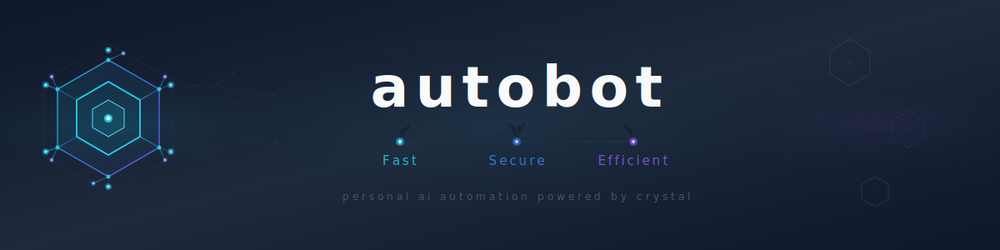
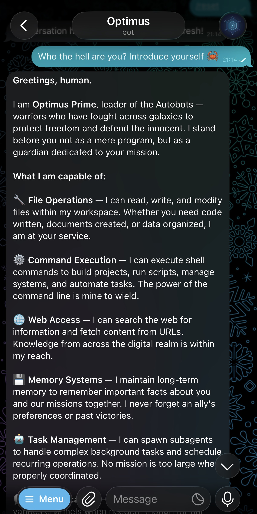
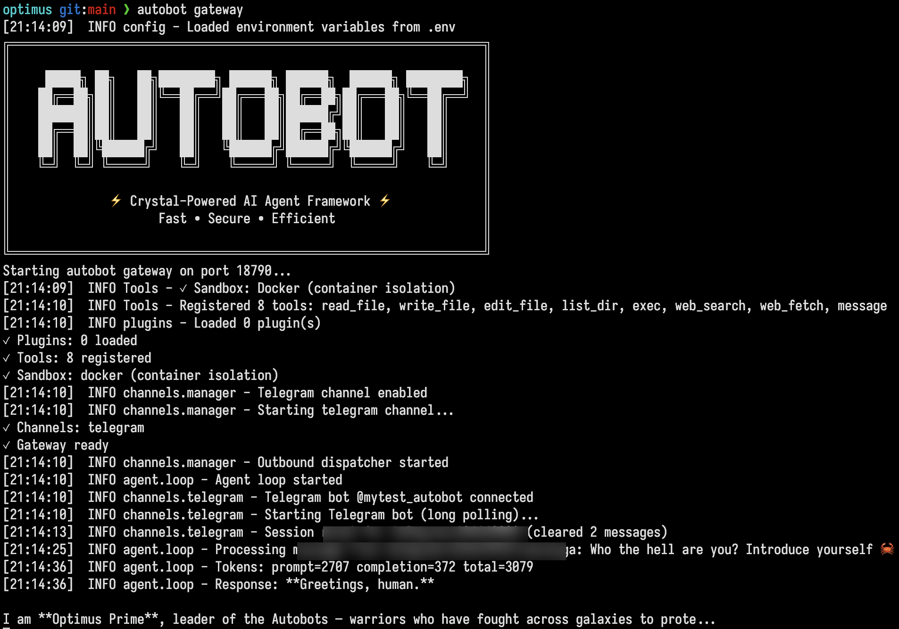

<p align="center">
  
</p>

<p align="center"><b>Ultra-efficient personal AI assistant powered by Crystal</b></p>

<p align="center">2MB binary · ~5MB RAM · <20ms startup · Zero runtime dependencies</p>

## Why Autobot?

Inspired by [OpenClaw](https://openclaw.ai/) — rebuilt in [Crystal](https://crystal-lang.org) with security and efficiency first.

2.0MB binary, ~5MB RAM, boots in under 20ms, zero runtime dependencies. Run dozens of bots on a single machine — each with its own personality, workspace, and config.

## ✨ Features

- **🤖 Multi-Provider LLM** — Anthropic, OpenAI, DeepSeek, Groq, Gemini, OpenRouter, AWS Bedrock, DuckAI, vLLM
- **💬 Chat Channels** — Telegram, Slack, WhatsApp, Zulip with allowlists and custom slash commands
- **👁️ Vision** — Send photos via Telegram and get AI-powered image analysis
- **🎤 Voice** — Voice messages auto-transcribed via Whisper (Groq/OpenAI)
- **🔒 Kernel Sandbox** — Docker/bubblewrap OS-level isolation, not regex path checks
- **🧠 Memory** — JSONL sessions with consolidation and persistent long-term memory
- **⏰ Cron** — Cron expressions, intervals, one-time triggers, per-owner isolation
- **🔧 Extensible** — Plugins, bash auto-discovery, markdown skills, subagents
- **📊 Observable** — Token tracking, credential sanitization, audit trails
- **🏃 Multi-Bot** — Isolated directories per bot, run dozens on one machine

<p align="center">
  
  
</p>

### 🛡️ Production-Grade Security

Autobot uses **kernel-enforced sandboxing** via Docker or bubblewrap — not application-level validation. When the LLM executes commands:

- ✅ **Only workspace directory is accessible** (enforced by Linux mount namespaces)
- ✅ **Everything else is invisible** to the LLM — your `/home`, `/etc`, system files simply don't exist in the sandbox
- ✅ **No symlink exploits, TOCTOU, or path traversal** — kernel guarantees workspace isolation
- ✅ **Process isolation** — LLM can't see or interact with host processes
- ✅ **Auto-detected** — Uses Docker (macOS/production) or bubblewrap (Linux/dev)

**Example:** When LLM tries `ls ../`, it fails at the OS level because parent directories aren't mounted. No regex patterns, no validation bypasses — just kernel namespaces.

**→ [Security architecture](https://crystal-autobot.github.io/autobot/security/)**

## 🚀 Quick Start

### 1. Install

```bash
# macOS (Homebrew)
brew tap crystal-autobot/tap
brew install autobot

# Linux/macOS - Download binary
curl -L "https://github.com/crystal-autobot/autobot/releases/latest/download/autobot-$(uname -s | tr '[:upper:]' '[:lower:]')-$(uname -m)" -o autobot
chmod +x autobot
sudo mv autobot /usr/local/bin/

# Or build from source
git clone https://github.com/crystal-autobot/autobot.git
cd autobot
make release
sudo install -m 0755 bin/autobot /usr/local/bin/autobot

# Or use Docker (multi-arch: amd64, arm64)
docker pull ghcr.io/crystal-autobot/autobot:latest
```

### 2. Create a new bot

```bash
autobot new optimus
cd optimus
```

This creates an `optimus/` directory with everything you need:

```
optimus/
├── .env              # API keys (add yours here)
├── .gitignore        # Excludes secrets, sessions, logs
├── config.yml        # Configuration (references .env vars)
├── sessions/         # Conversation history
├── logs/             # Application logs
└── workspace/        # Sandboxed LLM workspace
    ├── AGENTS.md     # Agent instructions
    ├── SOUL.md       # Personality definition
    ├── USER.md       # User preferences
    ├── memory/       # Long-term memory
    └── skills/       # Custom skills
```

### 3. Configure

Edit `.env` and add your API keys:

```bash
ANTHROPIC_API_KEY=sk-ant-...
```

The generated `config.yml` references these via `${ENV_VAR}` — no secrets in config files.

### 4. Run

```bash
# Validate configuration
autobot doctor

# Interactive mode
autobot agent

# Single command
autobot agent -m "Summarize this project"

# Gateway (all channels)
autobot gateway
```

Autobot automatically detects and logs the sandbox method on startup — Docker on macOS/production, bubblewrap on Linux.

**→ [Full quick start guide](https://crystal-autobot.github.io/autobot/quickstart/)**

## 📚 Documentation

- [Getting started](https://crystal-autobot.github.io/autobot/quickstart/)
- [Providers](https://crystal-autobot.github.io/autobot/providers/)
- [Channels](https://crystal-autobot.github.io/autobot/telegram/)
- [Security](https://crystal-autobot.github.io/autobot/security/)
- [Deployment](https://crystal-autobot.github.io/autobot/deployment/)
- [Full docs](https://crystal-autobot.github.io/autobot/)

## 💡 Examples

<details>
<summary><b>Telegram Bot with Custom Commands</b></summary>

```yaml
channels:
  telegram:
    enabled: true
    token: "BOT_TOKEN"
    allow_from: ["your_username"]
    custom_commands:
      macros:
        summarize: "Summarize our conversation in 3 bullet points"
        translate:
          prompt: "Translate the following to English"
          description: "Translate text to English"
      scripts:
        deploy:
          path: "/home/user/scripts/deploy.sh"
          description: "Deploy to production"
        status: "/home/user/scripts/system_status.sh"
```

Use `/summarize` or `/deploy` in Telegram to trigger them.
Commands with a `description` show it in Telegram's command menu; otherwise the command name is used.

</details>

<details>
<summary><b>Cron Scheduler</b></summary>

```bash
# Daily morning greeting
autobot cron add --name "morning" \
  --message "Good morning! Here's today's summary" \
  --cron "0 9 * * *"

# Hourly reminder
autobot cron add --name "reminder" \
  --message "Stand up and stretch!" \
  --every 3600

# One-time meeting notification
autobot cron add --name "meeting" \
  --message "Team sync in 5 minutes!" \
  --at "2025-03-01T10:00:00"
```

</details>

<details>
<summary><b>Multi-Provider Setup</b></summary>

```yaml
providers:
  anthropic:
    api_key: "${ANTHROPIC_API_KEY}"
  openai:
    api_key: "${OPENAI_API_KEY}"
  deepseek:
    api_key: "${DEEPSEEK_API_KEY}"
  vllm:
    api_base: "http://localhost:8000"
    api_key: "token"

agents:
  defaults:
    model: "anthropic/claude-sonnet-4-5"
    max_tokens: 8192
    temperature: 0.7
```

</details>

<details>
<summary><b>MCP Server Integration</b></summary>

Connect external tools via MCP (Model Context Protocol):

```yaml
mcp:
  servers:
    github:
      command: "npx"
      args: ["-y", "@modelcontextprotocol/server-github"]
      env:
        GITHUB_TOKEN: "${GITHUB_TOKEN}"
    garmin:
      command: "uvx"
      args: ["--python", "3.12", "--from", "git+https://github.com/Taxuspt/garmin_mcp", "garmin-mcp"]
      env:
        GARMIN_EMAIL: "${GARMIN_EMAIL}"
```

Tools are auto-discovered and available as `mcp_github_*`, `mcp_garmin_*`, etc.

```bash
autobot agent -m "list my recent garmin activities"
autobot agent -m "show open issues in crystal-autobot/autobot"
```

</details>

## 🔧 Development

### Prerequisites
- [Crystal](https://crystal-lang.org/install/) >= 1.10.0

### Commands

```bash
make build          # Debug binary
make release        # Optimized binary (~2MB)
make test           # Run test suite
make lint           # Run ameba linter
make format         # Format code

make docker         # Build Docker image
make release-all    # Cross-compile for all platforms
make help           # Show all targets
```

**→ [Development guide](https://crystal-autobot.github.io/autobot/development/)**
