# Architecture

Autobot is organized around a message-driven agent loop. Channels receive user input, the agent loop orchestrates LLM interactions and tool execution, and responses flow back through the same channel.

## System Overview

```mermaid
graph LR
    subgraph Channels["Channels"]
        direction TB
        CLI[CLI]
        TG[Telegram]
        SL[Slack]
        WA[WhatsApp]
    end

    BUS((Event Bus))

    subgraph Agent["Agent Core"]
        direction TB
        LOOP[Agent Loop]
        CTX[Context Builder]
        MEM[Memory]
        SESS[Sessions]
    end

    LLM[LLM Provider\nAnthropic · OpenAI\nDeepSeek · Groq · Gemini]

    subgraph Tools["Tools"]
        direction TB
        BASH[Bash]
        FS[Filesystem]
        WEB[Web Search]
        MCP[MCP Servers]
        SPAWN[Subagents]
        PLG[Plugins]
    end

    SAND[Sandbox\nDocker · Bubblewrap]
    CRON[Cron\nScheduler]

    CLI & TG & SL & WA --> BUS
    CRON -.->|scheduled| BUS
    BUS --> LOOP
    LOOP --- CTX & MEM & SESS
    LOOP -->|request| LLM
    LLM -->|tool calls| BASH & FS & WEB & MCP & SPAWN & PLG
    BASH & FS --> SAND
    LOOP -.->|response| BUS

    style BUS fill:#7c4dff,stroke:#651fff,color:#fff
    style LOOP fill:#5c6bc0,stroke:#3949ab,color:#fff
    style CTX fill:#7986cb,stroke:#5c6bc0,color:#fff
    style MEM fill:#7986cb,stroke:#5c6bc0,color:#fff
    style SESS fill:#7986cb,stroke:#5c6bc0,color:#fff
    style LLM fill:#26a69a,stroke:#00897b,color:#fff
    style CLI fill:#42a5f5,stroke:#1e88e5,color:#fff
    style TG fill:#42a5f5,stroke:#1e88e5,color:#fff
    style SL fill:#42a5f5,stroke:#1e88e5,color:#fff
    style WA fill:#42a5f5,stroke:#1e88e5,color:#fff
    style BASH fill:#ffa726,stroke:#fb8c00,color:#fff
    style FS fill:#ffa726,stroke:#fb8c00,color:#fff
    style WEB fill:#ffa726,stroke:#fb8c00,color:#fff
    style MCP fill:#ffa726,stroke:#fb8c00,color:#fff
    style SPAWN fill:#ffa726,stroke:#fb8c00,color:#fff
    style PLG fill:#ffa726,stroke:#fb8c00,color:#fff
    style SAND fill:#ef5350,stroke:#e53935,color:#fff
    style CRON fill:#ab47bc,stroke:#8e24aa,color:#fff
```

## Request Lifecycle

1. **Message ingress** — A channel adapter (CLI, Telegram, Slack, WhatsApp) receives user input and publishes it to the event bus.
2. **Context assembly** — The agent loop picks up the message and builds the full LLM context: system prompt, conversation history from the session store, relevant memories, and available skills.
3. **LLM request** — The assembled context is sent to the configured LLM provider (Anthropic, OpenAI, DeepSeek, Groq, Gemini, OpenRouter, or vLLM).
4. **Tool execution** — If the LLM response contains tool calls, each tool is executed through the tool registry. Shell commands run inside a kernel-enforced sandbox (Docker or bubblewrap). MCP tools are proxied to external servers.
5. **Iteration** — Tool results are fed back into the agent loop. The LLM can issue further tool calls, creating a multi-turn execution cycle until it produces a final text response.
6. **Message egress** — The final response is published to the event bus and delivered back through the originating channel.

## Core Components

### Channels (`channels/`)

Channel adapters handle protocol-specific communication (HTTP webhooks, WebSocket, polling) and normalize messages into a common format. Each channel supports media downloads for [vision and voice](media.md) processing.

| Channel | Transport | Features |
|---------|-----------|----------|
| CLI | stdin/stdout | Interactive and single-command modes |
| Telegram | HTTP polling | Photos, voice, custom commands, allowlists |
| Slack | WebSocket | Thread support, file uploads |
| WhatsApp | HTTP webhooks | Media messages |

### Agent Loop (`agent/`)

The core orchestration engine. When a message arrives, it builds context from bootstrap files (AGENTS.md, SOUL.md, USER.md), conversation history, and memory. It then enters a loop: call the LLM, execute any requested tools inside the sandbox, feed results back, and repeat — up to a configurable maximum of iterations. Once the LLM produces a final text response, the result is saved to the session and sent back to the channel.

```mermaid
graph LR
    CHAT["📡 Channels\nTelegram · Slack · WhatsApp · CLI"]

    CHAT --> MSG["💬 Message"]

    subgraph Loop["Agent Loop"]
        MSG --> LLM["🤖 LLM"]
        LLM --> TOOLS["🔧 Tools"]
        TOOLS -->|results| LLM
        LLM -->|done| RSP["💬 Response"]
    end

    RSP --> CHAT

    subgraph Context
        direction TB
        MEM["🧠 Memory"]
        SKL["⚡ Skills"]
    end

    Context <--> TOOLS

    style MSG fill:#fff3cd,stroke:#ffc107,color:#333
    style LLM fill:#ffe0b2,stroke:#ff9800,color:#333
    style TOOLS fill:#ffe0b2,stroke:#ff9800,color:#333
    style RSP fill:#ffcdd2,stroke:#ef5350,color:#333
    style CHAT fill:#e3f2fd,stroke:#90caf9,color:#333
    style MEM fill:#e8d5f5,stroke:#ab47bc,color:#333
    style SKL fill:#e8d5f5,stroke:#ab47bc,color:#333
```

On each turn, the agent loop:

- Assembles context via the **context builder** (system prompt + history + memory + skills)
- Handles **multimodal input** (images, voice transcription)
- Manages the **tool call loop** (execute → feed results → repeat)
- Supports **subagents** for parallel or delegated tasks
- Triggers **memory hooks** for session consolidation

### LLM Providers (`providers/`)

A unified HTTP interface to multiple LLM backends. All providers implement the same request/response contract, making model switching a config change. Token usage is tracked per request for observability.

### Tool System (`tools/`)

Tools are the agent's hands. The registry discovers and exposes tools to the LLM. Built-in tools include:

- **Bash** — Shell commands in a [sandboxed](sandboxing.md) environment
- **Filesystem** — Read/write files within the workspace
- **Web** — HTTP requests and [web search](web-search.md)
- **Cron** — Schedule recurring or one-time tasks
- **Spawn** — Launch subagents for parallel work
- **Message** — Send messages to channel owners

All shell execution goes through the **sandbox executor**, which enforces OS-level isolation via Docker or bubblewrap.

### Event Bus (`bus/`)

Internal pub/sub system that decouples channels from the agent loop. Messages, responses, and scheduled events all flow through the bus, enabling multi-channel operation from a single agent instance.

### Session Store (`session/`)

JSONL-based conversation persistence. Each session captures the full message history, enabling context continuity across restarts. Sessions are scoped per owner for multi-user isolation.

### Memory (`memory/`)

Long-term memory with two tiers:

- **Session memory** — Automatic consolidation of conversation history
- **Persistent memory** — Facts and preferences that survive across sessions

See [Memory](memory.md) for details.

### MCP Servers (`mcp/`)

[Model Context Protocol](mcp.md) client that connects external tool servers. Tools from MCP servers are auto-discovered and exposed to the LLM as `mcp_{server}_{tool}`.

### Plugins (`plugins/`)

[Plugin system](plugins.md) with bash auto-discovery and markdown skills. Plugins extend the agent's capabilities without modifying core code.

### Cron (`cron/`)

Scheduler supporting cron expressions, fixed intervals, and one-time triggers. When a job fires, it publishes a message through the event bus, triggering a full agent turn with all tools. Jobs carry persistent state for change detection (e.g., "notify only when steps change"). See [Cron & Scheduling](cron.md) for details.
