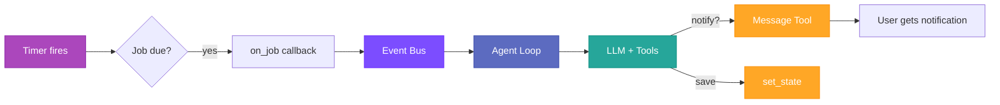

# Cron & Scheduled Tasks

Autobot includes a built-in scheduler for recurring checks, one-time reminders, and deferred tasks. Jobs fire as full agent turns with access to all tools.

---

## Overview

The cron system solves three common needs:

- **Monitoring** — "Notify me when my Garmin steps change" (recurring check with state comparison)
- **Reminders** — "Remind me to drink water in 30 minutes" (one-time deferred task)
- **Recurring reports** — "Send me a weather summary every morning at 9am" (cron expression)

When a job fires, it triggers a full agent turn — the agent can use MCP tools, web search, memory, and any other registered tools to complete the task.

---

## Schedule Types

### Fixed Interval (`every_seconds`)

Runs repeatedly at a fixed interval.

```
"Check my email every 5 minutes"
→ every_seconds: 300
```

### Cron Expression (`cron_expr`)

Standard 5-field cron syntax: `MIN HOUR DOM MON DOW`

```
"Send me a morning briefing at 9am"
→ cron_expr: "0 9 * * *"
```

### One-Time (`at`)

Runs once at a specific time, then auto-deletes.

```
"Remind me at 3pm to call the dentist"
→ at: "2026-02-20T15:00:00Z"
```

---

## How It Works

### Job Execution Flow



1. **Timer fires** — The cron service detects a job is due
2. **Publish to bus** — An `InboundMessage` is published to the event bus with `channel: "system"` and `sender_id: "cron:{job_id}"`
3. **Agent turn** — The agent loop picks up the message and builds context with the job's prompt and previous state
4. **Tool execution** — The agent uses any tools needed (MCP, web search, etc.) to fulfill the task
5. **Conditional notification** — The agent compares current data with previous state and only notifies the user via the `message` tool if conditions are met
6. **State persistence** — The agent saves current data via `set_state` for comparison on the next run

### No Auto-Delivery

Cron turns **never** auto-deliver responses to the user. The agent must explicitly use the `message` tool to notify. This prevents unwanted notifications when conditions haven't changed.

---

## State Management

Each job has a `state` field (arbitrary JSON) that persists between runs. This enables the agent to compare current data with previous data and only notify on changes.

### How State Flows

1. **First run** — No previous state. Agent fetches data, notifies user, saves state
2. **Subsequent runs** — Previous state is injected into the prompt. Agent fetches current data, compares with previous state, only notifies if changed, then updates state

### State in the Prompt

When a cron job fires, the agent receives:

```
Check my Garmin steps and notify me if they changed.

Previous state (from last run): {"step_count":4976}

IMPORTANT: Compare current values with previous state above.
Only use `message` tool if values actually CHANGED. If unchanged, do NOT notify.
After checking, always save current data: call `cron` with action=`set_state`,
job_id=`abc123`, and state={...your data...}.
Use the exact same keys as in previous state to enable comparison on the next run.
```

### State Persistence

State is stored in `cron.json` alongside the job definition. It survives gateway restarts and is scoped per job.

---

## Configuration

### Enable Cron

```yaml
cron:
  enabled: true
  store_path: "./cron.json"  # Optional, defaults to workspace
```

### Agent Creates Jobs

The agent creates cron jobs via the `cron` tool when users make scheduling requests. The tool supports four actions:

| Action | Description | Required Parameters |
|--------|-------------|---------------------|
| `add` | Create a new job | `message` + one of: `every_seconds`, `cron_expr`, `at` |
| `list` | List jobs for current owner | — |
| `remove` | Delete a job | `job_id` |
| `set_state` | Save state for next run | `job_id`, `state` |

---

## CLI Management

### List Jobs

```bash
autobot cron list        # Show enabled jobs
autobot cron list --all  # Include disabled jobs
```

### Show Job Details

```bash
autobot cron show <job_id>
```

Output includes schedule, message, delivery config, and current state:

```
ID:       aa6d7d5c
Name:     Check Garmin steps
Status:   enabled
Schedule: every 60s
Next Run: 2026-02-20 09:00
Message:  Check steps and notify if changed
Deliver:  true
Channel:  telegram
To:       634643933
State:    {"step_count":4976}
```

### Add Jobs Manually

```bash
# Recurring interval
autobot cron add --name "standup" --message "Time for standup!" --every 3600

# Cron expression
autobot cron add --name "morning" --message "Good morning!" --cron "0 9 * * *"

# One-time
autobot cron add --name "reminder" --message "Call dentist" --at "2026-02-20T15:00:00Z"
```

### Remove a Job

```bash
autobot cron remove <job_id>
```

### Enable/Disable

```bash
autobot cron enable <job_id>
autobot cron disable <job_id>
```

### Force Run

```bash
autobot cron run <job_id>          # Run if enabled
autobot cron run <job_id> --force  # Run even if disabled
```

---

## Per-Owner Isolation

Jobs created via the `cron` tool are automatically scoped to the originating channel and chat. A Telegram user's jobs are isolated from a Slack user's jobs.

- **Owner format:** `channel:chat_id` (e.g., `telegram:634643933`)
- **List** only shows the current owner's jobs
- **Remove** only works on the current owner's jobs
- Jobs created via CLI have no owner restriction

---

## Examples

### Monitor and Notify on Change

User says: *"Check my Garmin steps every hour and notify me if they change"*

The agent creates:
```
cron add:
  message: "Use mcp_garmin_get_stats to get today's steps.
            Compare with previous state. Notify only if changed."
  every_seconds: 3600
```

**Run 1:** Steps = 3000. No previous state → notify + save `{"step_count": 3000}`
**Run 2:** Steps = 3000. Same as previous → no notification, save state
**Run 3:** Steps = 5000. Changed → notify + save `{"step_count": 5000}`

### One-Time Reminder

User says: *"Remind me in 30 minutes to take a break"*

The agent creates:
```
cron add:
  message: "Send the user a reminder to take a break."
  at: "2026-02-20T10:30:00Z"
```

Job fires once, sends reminder via `message` tool, then auto-deletes.

### Daily Report

User says: *"Send me a weather summary every morning at 9am"*

The agent creates:
```
cron add:
  message: "Use web_search to find current weather for user's location.
            Send a brief summary."
  cron_expr: "0 9 * * *"
```

---

## File Structure

```
workspace/
└── cron.json    # Job definitions + state (auto-created)
```

**Permissions:**

- `cron.json`: `0600` (user read/write only)
- Parent directory: `0700` (user-only access)

---

## Troubleshooting

### Agent notifies on every run (no change detection)

**Cause:** State keys are inconsistent between runs, making comparison impossible.

**Solution:** The prompt now instructs the agent to use the same keys as in previous state. If the issue persists, check the job's state with `autobot cron show <job_id>` and verify keys are stable.

### "Message sending not configured"

**Cause:** The `message` tool's send callback wasn't wired to the bus.

**Solution:** This is fixed in the gateway setup. Ensure you're running the latest build.

### Job doesn't fire

**Check:**

1. Is cron enabled in config? (`cron.enabled: true`)
2. Is the job enabled? (`autobot cron show <job_id>`)
3. Is the gateway running? (Jobs only fire while the gateway process is active)
4. Check logs for `Cron: executing job` entries

### State lost after restart

State is persisted in `cron.json` on every `set_state` call. If state is missing after restart, check file permissions and that the store path is correct.

---

## See Also

- [Architecture](architecture.md) — System design and message flow
- [Configuration](configuration.md) — Full config reference
- [Security](security.md) — File permissions and job isolation
