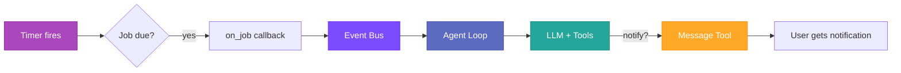

# Cron & Scheduled Tasks

Autobot includes a built-in scheduler for recurring checks, one-time reminders, and deferred tasks. Jobs fire as full agent turns with access to all tools.

---

## Overview

The cron system solves three common needs:

- **Reminders** — "Remind me to drink water in 30 minutes" (one-time deferred task)
- **Recurring reports** — "Send me a weather summary every morning at 9am" (cron expression)
- **Periodic tasks** — "Check my email every 5 minutes" (fixed interval)

When a job fires, it triggers a full agent turn — the agent can use MCP tools, web search, memory, and any other registered tools to complete the task.

---

## Schedule Types

### Fixed Interval (`every_seconds`)

Runs repeatedly at a fixed interval.

```
"Check my email every 5 minutes"
→ every_seconds: 300
```

### Cron Expression (`cron_expr`)

Standard 5-field cron syntax: `MIN HOUR DOM MON DOW`

```
"Send me a morning briefing at 9am"
→ cron_expr: "0 9 * * *"
```

### One-Time (`at`)

Runs once at a specific time, then auto-deletes.

```
"Remind me at 3pm to call the dentist"
→ at: "2026-02-20T15:00:00Z"
```

---

## How It Works

### Job Execution Flow



1. **Timer fires** — The cron service detects a job is due
2. **Publish to bus** — An `InboundMessage` is published to the event bus with `channel: "system"` and `sender_id: "cron:{job_id}"`
3. **Agent turn** — The agent loop picks up the message and executes the job's prompt
4. **Tool execution** — The agent uses any tools needed (MCP, web search, etc.) to fulfill the task
5. **Auto-delivery** — The agent's final response is automatically delivered to the user through the originating channel

---

## Configuration

### Enable Cron

```yaml
cron:
  enabled: true
  store_path: "./cron.json"  # Optional, defaults to workspace
```

### Agent Creates Jobs

The agent creates cron jobs via the `cron` tool when users make scheduling requests. The tool supports three actions:

| Action | Description | Required Parameters |
|--------|-------------|---------------------|
| `add` | Create a new job | `message` + one of: `every_seconds`, `cron_expr`, `at` |
| `list` | List jobs for current owner | — |
| `remove` | Delete a job | `job_id` |

---

## CLI Management

### List Jobs

```bash
autobot cron list        # Show enabled jobs
autobot cron list --all  # Include disabled jobs
```

### Show Job Details

```bash
autobot cron show <job_id>
```

Output includes schedule, message, and delivery config:

```
ID:       aa6d7d5c
Name:     Morning briefing
Status:   enabled
Schedule: 0 9 * * *
Next Run: 2026-02-21 09:00
Message:  Send a weather summary
Deliver:  true
Channel:  telegram
To:       634643933
```

### Add Jobs Manually

```bash
# Recurring interval
autobot cron add --name "standup" --message "Time for standup!" --every 3600

# Cron expression
autobot cron add --name "morning" --message "Good morning!" --cron "0 9 * * *"

# One-time
autobot cron add --name "reminder" --message "Call dentist" --at "2026-02-20T15:00:00Z"
```

### Remove a Job

```bash
autobot cron remove <job_id>
```

### Enable/Disable

```bash
autobot cron enable <job_id>
autobot cron disable <job_id>
```

### Force Run

```bash
autobot cron run <job_id>          # Run if enabled
autobot cron run <job_id> --force  # Run even if disabled
```

---

## Per-Owner Isolation

Jobs created via the `cron` tool are automatically scoped to the originating channel and chat. A Telegram user's jobs are isolated from a Slack user's jobs.

- **Owner format:** `channel:chat_id` (e.g., `telegram:634643933`)
- **List** only shows the current owner's jobs
- **Remove** only works on the current owner's jobs
- Jobs created via CLI have no owner restriction

---

## Examples

### One-Time Reminder

User says: *"Remind me in 30 minutes to take a break"*

The agent creates:
```
cron add:
  message: "Send the user a reminder to take a break."
  at: "2026-02-20T10:30:00Z"
```

Job fires once, sends reminder via `message` tool, then auto-deletes.

### Daily Report

User says: *"Send me a weather summary every morning at 9am"*

The agent creates:
```
cron add:
  message: "Use web_search to find current weather for user's location.
            Send a brief summary."
  cron_expr: "0 9 * * *"
```

### Periodic Check

User says: *"Check my email every 5 minutes"*

The agent creates:
```
cron add:
  message: "Check email and notify the user of new messages."
  every_seconds: 300
```

---

## File Structure

```
workspace/
└── cron.json    # Job definitions (auto-created)
```

**Permissions:**

- `cron.json`: `0600` (user read/write only)
- Parent directory: `0700` (user-only access)

---

## Troubleshooting

### Job doesn't fire

**Check:**

1. Is cron enabled in config? (`cron.enabled: true`)
2. Is the job enabled? (`autobot cron show <job_id>`)
3. Is the gateway running? (Jobs only fire while the gateway process is active)
4. Check logs for `Cron: executing job` entries

---

## See Also

- [Architecture](architecture.md) — System design and message flow
- [Configuration](configuration.md) — Full config reference
- [Security](security.md) — File permissions and job isolation
