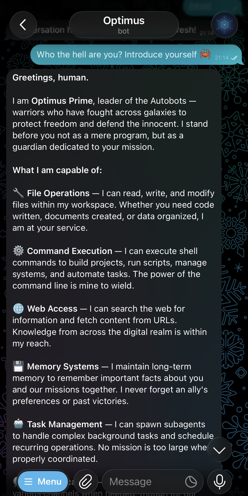
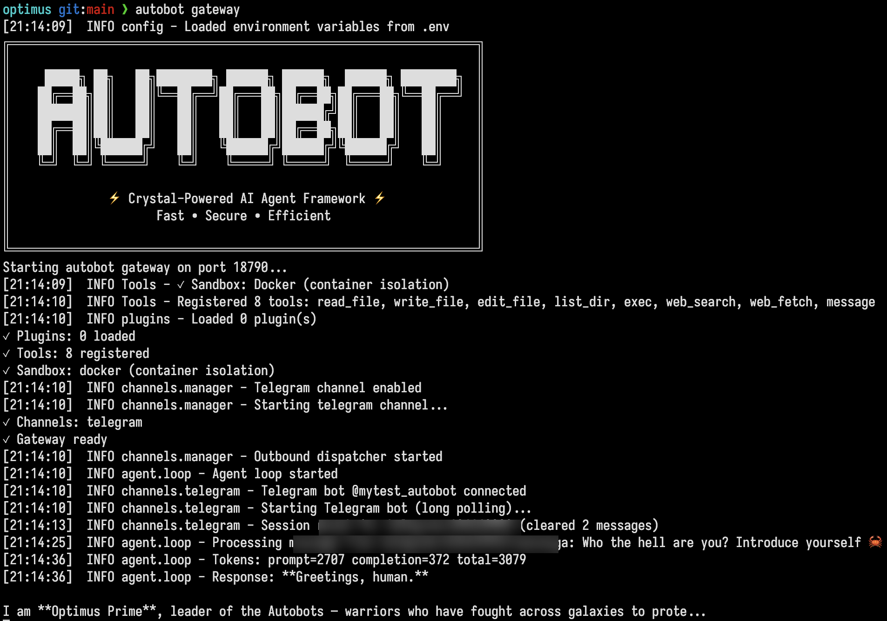

# Autobot

<div class="hero" markdown>

{ .hero-banner }

**Ultra-efficient personal AI assistant powered by Crystal**

2MB binary · ~5MB RAM · <20ms startup · Zero runtime dependencies

</div>

---

## Why Autobot?

Inspired by [OpenClaw](https://openclaw.ai/) — rebuilt in [Crystal](https://crystal-lang.org) with security and efficiency first.

2.0MB binary, ~5MB RAM, boots in under 20ms, zero runtime dependencies. Run dozens of bots on a single machine — each with its own personality, workspace, and config.

## Features

- **Multi-Provider LLM** — Anthropic, OpenAI, DeepSeek, Groq, Gemini, OpenRouter, AWS Bedrock, vLLM
- **Chat Channels** — Telegram, Slack, WhatsApp with allowlists and custom slash commands
- **Vision** — Send photos via Telegram and get AI-powered image analysis
- **Voice** — Voice messages auto-transcribed via Whisper (Groq/OpenAI)
- **Kernel Sandbox** — Docker/bubblewrap OS-level isolation, not regex path checks
- **Memory** — JSONL sessions with consolidation and persistent long-term memory
- **Cron** — Cron expressions, intervals, one-time triggers, per-owner isolation
- **Extensible** — Plugins, bash auto-discovery, markdown skills, subagents
- **Observable** — Token tracking, credential sanitization, audit trails
- **Multi-Bot** — Isolated directories per bot, run dozens on one machine

<div class="demo-screenshots" markdown>

{ .demo-img }
{ .demo-img }

</div>

## Production-Grade Security

Autobot uses **kernel-enforced sandboxing** via Docker or bubblewrap — not application-level validation. When the LLM executes commands:

- **Only workspace directory is accessible** (enforced by Linux mount namespaces)
- **Everything else is invisible** to the LLM — your `/home`, `/etc`, system files simply don't exist
- **No symlink exploits, TOCTOU, or path traversal** — kernel guarantees workspace isolation
- **Process isolation** — LLM can't see or interact with host processes

[Learn more about Security](security.md){ .md-button }

[Architecture Overview](architecture.md){ .md-button }

## Providers

Autobot works with all major LLM providers — pick the one that fits your needs:

| Provider | Best for |
|---|---|
| [Anthropic](anthropic.md) | Claude models via native API |
| [OpenAI](openai.md) | GPT-5 family, Whisper transcription |
| [DeepSeek](deepseek.md) | Low-cost, strong reasoning |
| [Groq](groq.md) | Ultra-fast inference, free tier |
| [Google Gemini](gemini.md) | Gemini Pro and Flash |
| [OpenRouter](openrouter.md) | Hundreds of models, one API key |
| [AWS Bedrock](bedrock.md) | Enterprise, IAM-based access |
| [vLLM / Local](vllm.md) | Full privacy, self-hosted |

[All providers](providers.md){ .md-button .md-button--primary }

## Quick Start

```bash
# macOS (Homebrew)
brew tap crystal-autobot/tap
brew install autobot

# Create and run a bot
autobot new optimus
cd optimus
autobot agent
```

[Full Quick Start Guide](quickstart.md){ .md-button .md-button--primary }
